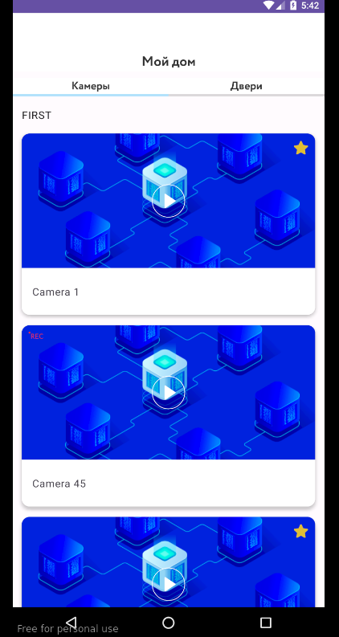
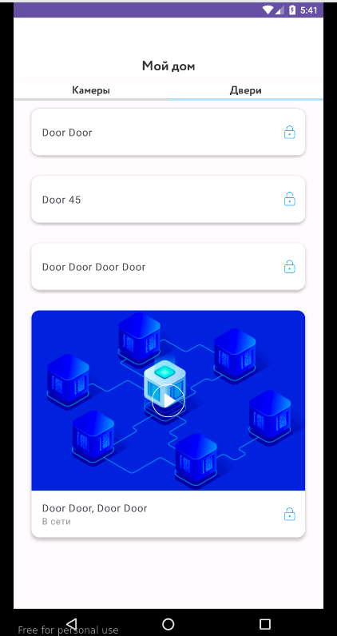
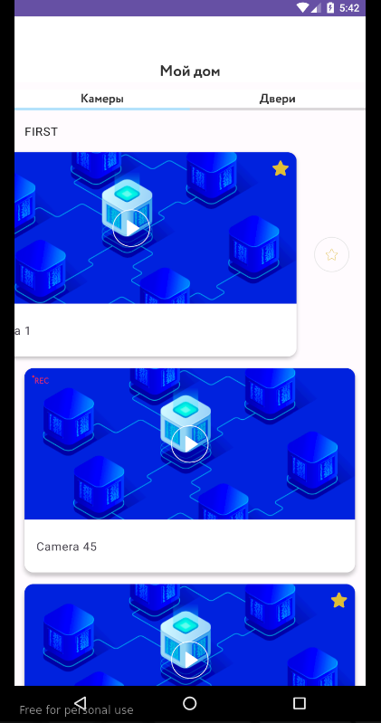
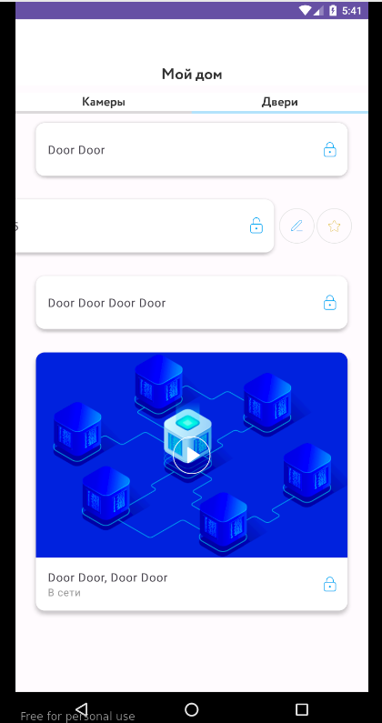
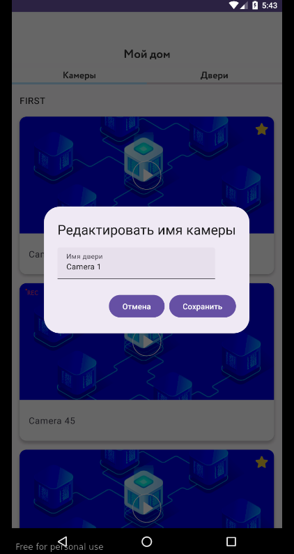

# MyHouse

**Приложение выполнено в рамках тестового задния [компании](http://rikmasters.ru/) "Рик Мастерс" **

## Основной функционал:
* Приложение состоит из двух экранов. Экран информации о видеокамерах в комнатах и экран с информацией о видеокамерах с дверей.
* Информация загружается о видеокамерах загружается по API и сохраняеться в локлаьном хранилище приложения.
* Есть возможнось редактировать название в карточки видеокамеры.
* Реализовано pull-to-refresh для всех экранов.

## UI и скриншоты

 

| Cameras Screen                                     | Doors Screen                                                   |
|----------------------------------------------------|----------------------------------------------------------------|
 |    |                   |
 |    |                   |
 |  |  |

## Использованные технологии

* Jetpack Compose
* Realm database
* Ktor
* DI Koin
* Coil
* Navigation
* ViewModel
* LiveData
* Material
* Google Accompanist

## Сборка и запуск

Сборка и запуск средствами Android Studio без особенностей.
** [Ссылка на дизайн](https://www.figma.com/file/zzhf0xOS7FP6jWK2Tqb1Gy/internship?node-id=0%3A1&t=cXpylF8FuatqK0pR-1)

